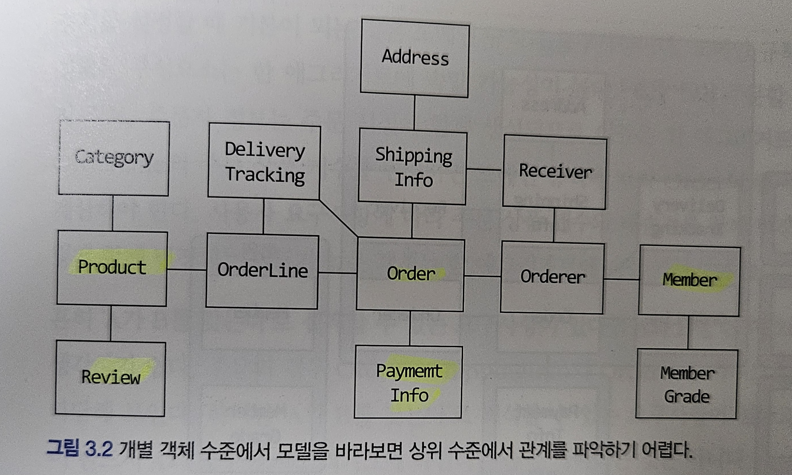
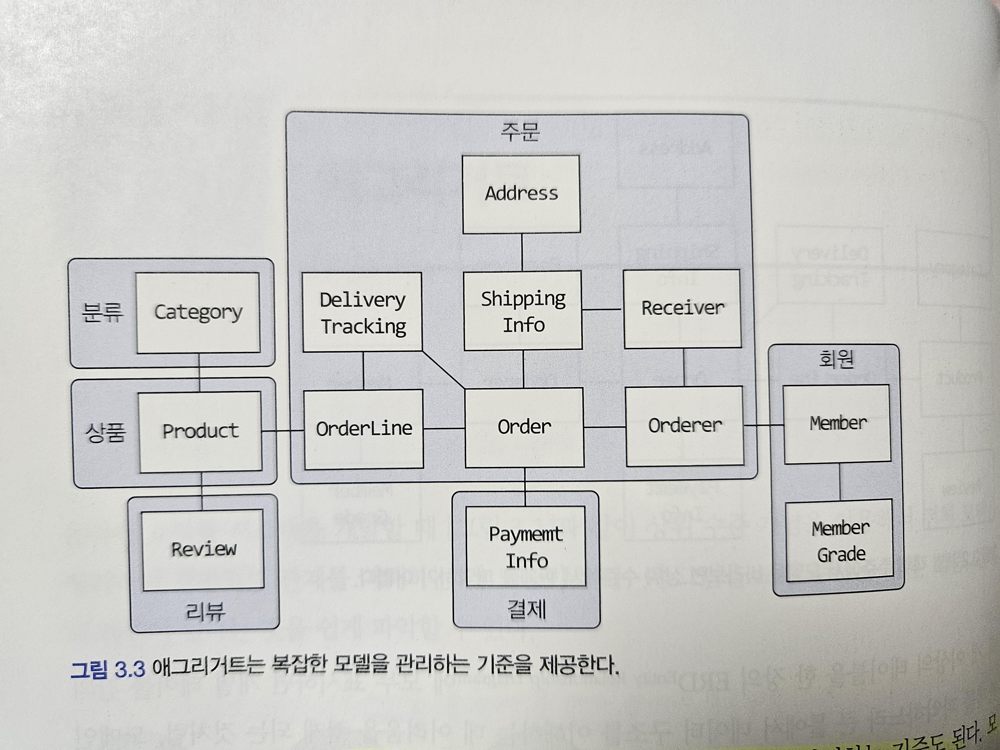
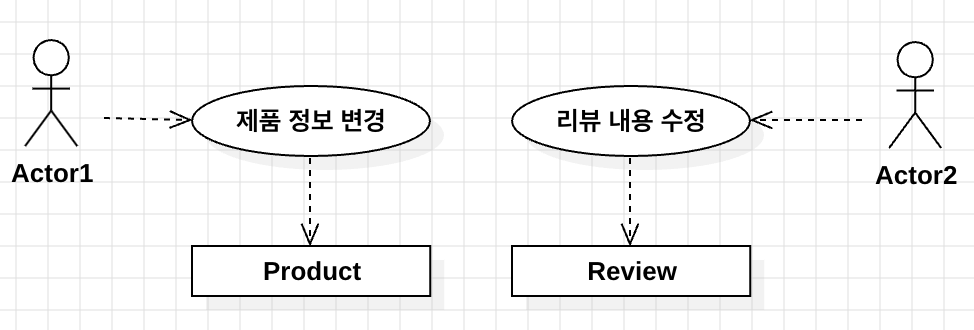
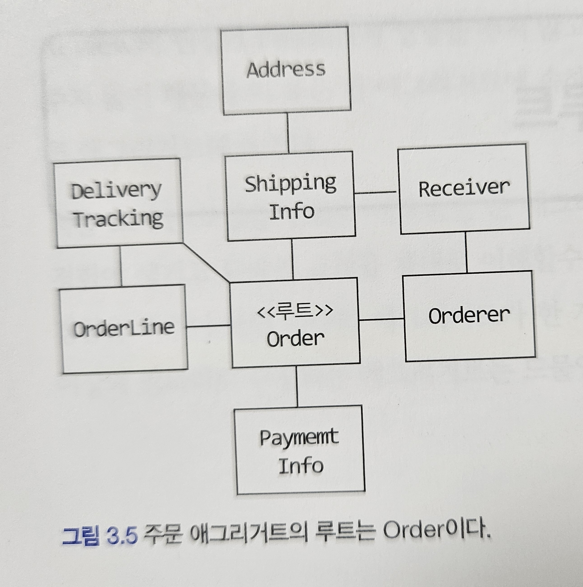

# Ch.3 애그리거트

## 애그리거트는 왜 필요할까?

### 도식화로 살펴보기

`애그리거트`란 관련된 객체를 하나로 모아둔 단위를 의미한다. 주요 도메인 요소간 관계를 파악하기 어렵다는것은 그만큼 확정성이 떨어진다는 의미가 된다. 도메인 객체 모데링 복잡해지면 개별 구성요소 위주로 모델을 이해하게 되고 전반적인 구조나 큰 수준에서 도메인간 관계를 파악하기 어려워진다.



위 모델의 하이라이트 부분이 상위 수준의 모델들이다. 만약에 하이라이트가 되어있지 않았다면,바로 몰랐을 가능성이 높으며, 앞서 말했듯이 개별의 모델에 집중하고, 큰 구조에 집중을 못할 가능성이 높다. 이를 `애그리거트`로 묶어보면 아래 사진과 같다



위 사진을 통해 최상위 모델은 어떤것이며, 각각의 도메인에 소속된 모델이 어떤것인지 더욱 확실히 할 수 있다. **`애그리거트`는 모델을 이해하는데 도움을 줄 뿐 아니라 일관성을 관리하는 기준이기도하다.**

위 사진에서 볼 수 있듯이 `애그리거트`는 경계를 갖는다. 한 `애그리거트`에 속한 객체는 다른 `애그리거트`에 속하지 않는다.`애그리거트`는 독립된 객체 군이며 각 애그리거트는 자기 자신을 관리할 뿐 다른 `애그리거트`를 관리하진 않는다.

### 애그리거트와 경계

경계를 설정할 때 기본이 되는것은 `도메인 규칙`과 `요구사항`이다. 도메인 규칙에 따라 함께 생성되는 구성요소는 동일한 `애그리거트`에 속할 가능성이 높다.



예시로 상품과 리뷰를 들어본다. `Product` 엔티티와 `Review`엔티티가 하나의 엔티티에 속할 것으로 생각할 수 있지만, `Product`와 `Reveiew`는 같이 생성되지 않는다. 또한 각각을 변경하는 주체 또한 상품 판매자와 소비자로 다르다. 즉, 서로 독립된 `애그리거트`에 속하게 되는것이다.

## 애그리거트 루트

`애그리거트`는 여러 객체로 구성된다. 그렇기에 하나의 객체만 정상이면 안된다. 도메인 규칙을 지키기 위해서는 `애그리거트`에 속한 모든 객체가 정상 상태를 가져야한다.

`애그리거트`에 속한 모든 객체가 일관된 상태를 유지하기 위해 `애그리거트`전체를 관리할 주체가 필요하며, 이를 `애그리거트 루트`라고 한다. `애그리거트 루트`는 `애그리거트`의 대표 엔티티이다. 그리고 `애그리거트`에 속한 객체는 `애그리거트 루트`에 직접 혹인 간접적으로 소속되게 된다.



### 도메인 규칙과 일관성

`애그리거트 루트`의 핵심 역할은 `애그리거트`의 일관성이 깨지지 않도록 하는 것이다. `애그리거트 루트`는 일관성이 깨지지 않도록 하기 위해 메소드를 제공한다.

```typescript
class Order {
  private state: OrderState;
  public changeShippingInfo(info: ShippingInfo) {
    this.verifyNotShipped();
  }

  private verifyNotShipped() {
    if (
      this.state != OrderState.PAYMENT_WAITING &&
      this.state != OrderState.PREPARING
    ) {
      throw new Error("Already shipped");
    }
  }

  public setShippingInfo(info: ShippingInfo) {
    //Implement
  }
}
```

**`애그리거트` 외부에서 `애그리거트` 내에 속한 객체를 직접 변경하면 안된다.** 만약 `getShippingInfo`와 같이 ShippingInfo를 외부에 반환한 뒤 ShippingInfo객체가 외부의 Setter 호출로 변경될 수 있다면 이는 애그리거트 루트가 강제하는 규칙을 적용할 수 없다는 일관성이 깨지게 된다.

```typescript
const shippingInfo = order.getShippingInfo();
shippingInfo.setAddress(someAddress); // 애그리거트 루트 이외의 변경으로 인해 일관성이 깨진다.
```

또한 특정 검사 로직에 대해서는 중복성을 없애야한다. 만약 `verifyNotShipped`의 로직이 필요할때마다 각 메소드에서 작성된다면 유지보수성이 매우 낮아진다.

불필요한 중복성 제거와 `애그리거트 루트`에 의한 강제성 부여로 일관성을 높이려면 아래 두가지를 습관화 해야한다.

- 단순히 필드 변경하는 `setter`는 public으로 만들지 않는다.
- Value Type은 불변으로 구현한다.

### 트랜잭션 범위

트랜잭션 범위는 작을수록 좋다. 트랜잭션 내에서(JPA의 `@Transactional`) 세개의 테이블을 수정한다면 잠금상태가 되는 테이블은 많아지고 이는 애플리케이션이 동시에 처리할 수 있는 양이 줄어들며, 전반적인 성능에 영향을 미친다.

부득이하게 트랜잭션으로 두개 이상의 `애그리거트`를 수정해야한다면, `애그리거트`에서 다른 `애그리거트`를 수정하는것이 아닌, 응용 서비스에서 두 `애그리거트`를 수정하도록 구현한다.

## 애그리거트와 레포지토리

애그리거트는 완전한 한개의 도메인 모델을 표현한다. 레포지토리는 `애그리거트` 단위로 존재한다. 애그리거트는 개념적으로 하나이기 때문에, 레포지토리는 애그리거트 전체를 저장소에 영속화 해야한다.

> Order와 Order Line 각각 다른 테이블에 저장한다고 해서 독립적인 레포지토리를 만들지 않는다. 대신 애그리거트 루트인 Order에 대한 레포지토리만 존재한다.

## ID를 활용한 애그리거트 참조

`애그리거트`를 다른 `애그리거트`를 통해 참조할 수 있다. `애그리거트 루트`의 관리 주체는 `애그리거트 루트`이므로, **애그리거트에서 다른 애그리거트를 참조한다는것은 다른 애그리거트 루트를 참조한다와 동일한 의미이다.**

애그리거트 루트에 대한 참조를 할 때 일반적인 필드(혹은 public getter)로 참조할 수 도 있다. 하지만 이러한 일반 필드를 통한 참조는 문제점을 일으킬 가능성이 높다.

- 편한 탐색 오용
  - 한 애그리거트 내부에서 다른 애그리거트 객체에 접근할 수 있게되면, 애그리거트 상태를 쉽게 변경할 수 있게된다.
- 성능에 대한 고민
  - 상황에 따라 지연 로딩이 유리한지, 즉시 로딩이 유리한지 판별해야한다.(JPQL/Criteria 로딩전략)
- 확장의 어려움
  - 여러개의 DBMS를 사용하는 경우, 다른 애그리거트 참조를 위해 동일한 Persistant API를 활용하지 못할 수 있다. 즉 단일 기술의 의존도로 인한 확장의 어려움이 있을 수 있다.

ID참졸르 사용하면 모든 객체가 참조로 연결되지 않고 한 애그리거트에 속한 객체들만 참조로 연결된다. 이는 명확한 경계와 물리적 연결을 제거함으로서 모델의 복잡도를 낮춰준다.

### ID를 활용한 조회 성능

단순히 ID를 통해 참조를 한다면, 여러 애그리거트를 읽을 때 조회속도가 문제가 될 수 있다. 이유는 각각의 ID에 대한 조회로 인해 Join연산을 통해 한번 할 수 있는 연산을 여러번 나눠서 조회하므로 지연이 발생하는 것이다. 이는 JPA에서는 조회 전용쿼리를 사용할 수 있으며 Prisma에서는 Fluent API를 활용해서 처리할 수 있다.

애그리거트마다 서로 다른 저장소를 활용하는 경우 한번의 쿼리로 애그리거트를 조회할 수 없는데 주로 이를 향상시키기 위해 캐시를 활용하거나 조회 전용 저장소를 따로 구성한다.

> Join연산시, 활용하는 DBMS에 따라 성능 고려 또한 필요하다. 예를 들어 연산 과정에서 CPU 리소스가 메인이 되는 MongoDB의 경우, Join과 비슷한 연산에 해당하는 `$lookup` 연산은 오용할 경우 해당 엔진을 활용하는 저장소, 더 나아가 애그리거트 자체의 성능에 영향을 줘 애플리케이션 속도를 저하시킬 수 있다.
